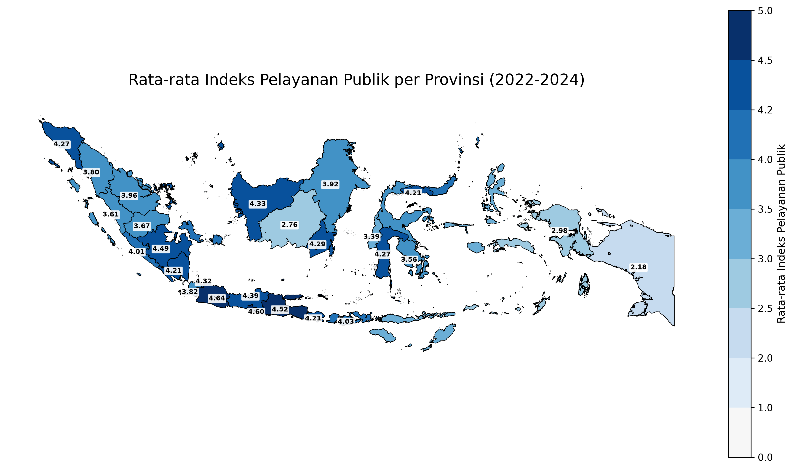
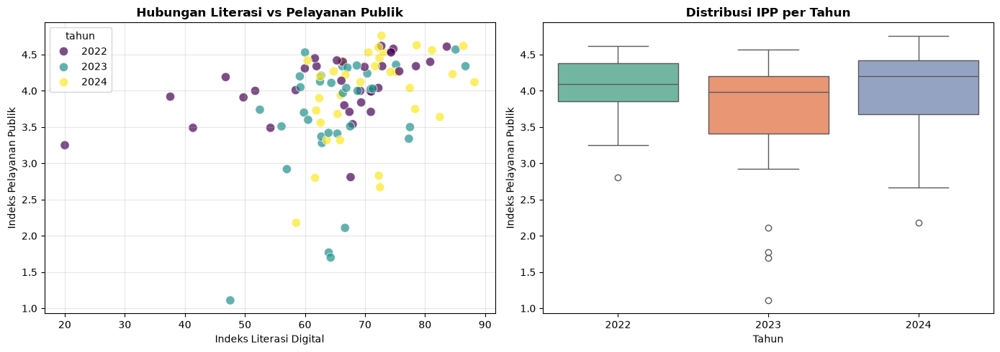

# Analisis Indeks Masyarakat Digital Indonesia (2022–2025)

Proyek ini bertujuan untuk menganalisis dan memvisualisasikan Indeks Masyarakat Digital Indonesia (IPM Digital) per provinsi selama periode 2022–2025. Data diperoleh dari berbagai sumber terbuka dan diolah menggunakan Python, dengan pendekatan analisis spasial dan statistik.

## 📊 Hasil Analisis

Berikut adalah visualisasi utama yang dihasilkan dari analisis:

### 🗺️ Heatmap Sebaran Indeks per Provinsi


### 📊 Scatterplot & Boxplot


---

## 📁 Struktur Proyek

```
.
├── Clean Data/                         # Data hasil pembersihan (panel lengkap)
│   └── data_panel_lengkap.csv
├── Raw Data/                           # Data mentah dari berbagai sumber
│   ├── Data Indeks Masyarakat Digital Indonesia Provinsi 2022.xlsx
│   ├── Data Indeks Masyarakat Digital Indonesia Provinsi 2023.xlsx
│   ├── Data Indeks Masyarakat Digital Indonesia Provinsi 2024.xlsx
│   ├── Data Indeks Masyarakat Digital Indonesia Provinsi 2025.xlsx
│   ├── vertikalkementerian-2-od_20431_indeks_daya_saing_digital__prov_di_indonesia_v6_data.csv
│   ├── vertikalkementerian-2-od_34152_indeks_pmbngnn_literasi_msyrkt__prov_di_indonesia_v2_data.csv
│   └── vertikalkementerian-2-od_34154_indeks_pelayanan_publik__prov_di_indonesia_v1_data.csv
├── Analisis.ipynb                      # Notebook analisis utama
├── Data Cleaning.ipynb                 # Notebook pembersihan data
├── README.md                           # Dokumentasi proyek
├── eda_literasi_pelayanan_publik.png   # Gambar Scatterplot & Boxplot
├── heatmap_ipp_indonesia.png           # Gambar heatmap
└── requirements.txt                    # Dependensi Python
```

## 📊 Data

Data mentah bersumber dari:

- **Indeks Masyarakat Digital Indonesia** per provinsi tahun 2022–2025 (format Excel).
- **Data pendukung** dari portal data publik Kementerian terkait, meliputi:
  - Indeks Daya Saing Digital
  - Indeks Pembangunan Literasi Masyarakat
  - Indeks Pelayanan Publik

Data mentah disimpan di folder `Raw Data/`, dan hasil pembersihan (panel lengkap) tersimpan di `Clean Data/data_panel_lengkap.csv`.

## 🛠️ Metodologi

1. **Pembersihan Data** (`Data Cleaning.ipynb`)
   - Menggabungkan data dari berbagai sumber
   - Menangani nilai hilang dan inkonsistensi
   - Menstandarkan format dan variabel

2. **Analisis Eksploratif** (`Analisis.ipynb`)
   - Statistik deskriptif per provinsi dan tahun
   - Tren temporal dan perbandingan antarprovinsi
   - Analisis korelasi dengan indeks pendukung

## 📦 Dependensi

Proyek ini menggunakan lingkungan virtual `.venv` dengan paket-paket berikut:

```txt
pandas>=2.0.0
numpy>=1.24.0
matplotlib>=3.7.0
seaborn>=0.12.0
geopandas>=0.14.0
shapely>=2.0.0
folium>=0.15.0
plotly>=5.14.0
openpyxl>=3.1.0
xlrd>=2.0.0
pyogrio>=0.7.0
scipy>=1.10.0
statsmodels>=0.14.0
linearmodels>=5.0
```

Untuk menginstal dependensi secara lengkap, jalankan:

```bash
pip install -r requirements.txt
```

## 🚀 Cara Menggunakan

1. Kloning repositori ini.
2. Aktifkan virtual environment:
   ```bash
   source .venv/Scripts/activate   # Windows
   source .venv/bin/activate       # Linux/Mac
   ```
3. Buka dan jalankan notebook secara berurutan:
   - `Data Cleaning.ipynb`
   - `Analisis.ipynb`
4. Jalankan skrip visualisasi (opsional):
   ```bash
   python create_heatmap.py
   ```
5. Ekspor hasil:
   ```bash
   python export.py
   ```

## 📝 Lisensi

Proyek ini bersifat terbuka untuk keperluan akademik dan riset kebijakan publik.